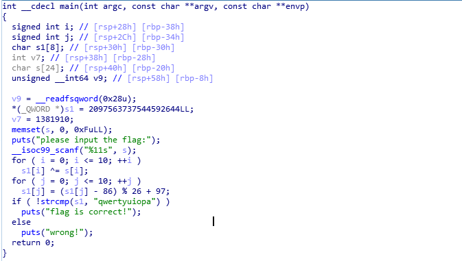

# Lab 1: ELF逆向分析
实验目的：熟悉Linux可执行文件的格式和调试方法。

实验环境：Ubuntu 16.04 LTS
实验工具：GCC、IDA Pro，GDB
实验目的：熟悉使用IDA Pro静态分析ELF文件
实验代码：

```c
#include  <stdio.h>
int main(int argc,char **argv,char **env)
{
    char encrypted_text[] = "\x04\x0d\x16\x1e\x1b\x0b\x1c\x1d\x16\x16\x15";
    char flag[15];
    memset(flag,0,15);
    puts("please input the flag:");
    scanf("%11s",flag);
    for(int i=0;i<11;i++)
    {
        encrypted_text[i] ^= flag[i];
    }
    for (int i=0;i<11;i++)
    {
        encrypted_text[i] = (((encrypted_text[i] - 0x61) + 11)%26) + 0x61;
    }
    if(strcmp(encrypted_text,"qwertyuiopa")==0)
    {
        puts("flag is correct!");
    }
    else
    {
        puts("wrong!");
    }
    return 0;
}

```

1. 使用gcc编译源代码并执行观察输入输出

   ```
   gcc flag.c -o flag
   ./flag
   ```

2. 使用IDA Pro分析可执行文件并使用IDA Pro的hex ray插件(f5)进行反编译

   

   

3. 分析程序中分析的算法并试解出正确flag。
4. 尝试使用gdb动态分析程序的输入如何被处理。