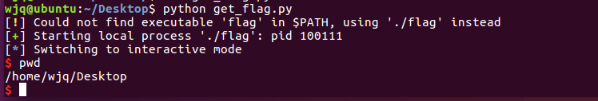

### return to shellcode

实验环境：Ubuntu 16.04 LTS 8086
实验工具：GDB、IDA
实验目的：分析Linux环境下的缓冲区溢出漏洞与shellcode

本次实验需要完成的实验任务如下：

1. 安装python pwntool安装步骤见http://docs.pwntools.com/en/stable/install/binutils.html#ubuntu。(已安装)

2. 运行get_flag.py脚本，利用flag可执行文件中的漏洞获取一个shell。

   

3. 利用IDA Pro分析flag程序中存在什么类型的漏洞，并解释如何利用该漏洞。

4. 在已经该漏洞的利用情况下，解释get_flag.py脚本中每一步的作用。

5. 在这一题中，如何做到不知道具体溢出长度的情况下利用该漏洞。(选做)